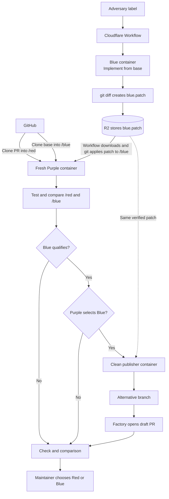

# Factory

A software factory: one Cloudflare Worker that receives GitHub webhooks and
routes them through a deterministic dispatcher to durable
[Flue](https://flueframework.com/) agents. Each capability (triage, review,
and more to come) is a folder of workflows, coordinators, and agents; adding a
capability means adding a folder and a routing rule.

Built by combining [withastro/astro-review](https://github.com/withastro/astro-review)
(absorbed nearly as-is — it already had this architecture) and
[withastro/triagebot-action](https://github.com/withastro/triagebot-action)
(ported from GitHub Actions to Workers).

## Scope

Factory is the triage and review automation **for the Astro repository's own
use** (`withastro/astro`): its routing rules, labels, skills, and the
release-security capability are tuned for how the Astro team works. It is
**not a general-purpose tool** for anyone to install — the package is private
by design, and the default configuration targets Astro's workflows.

If you want similar automation for your own project, **fork this repository**
and build your own workflows: point the router (`src/router.ts`) at your
events, adjust `.github/factory.yml` and the labels for your repository, and
replace the skills where your workflow differs. The architecture is modular
on purpose — capabilities are folders plus routing rules — so forking and
adapting beats installing.

## Architecture

```
GitHub webhooks ─→ Hono ingress (signature verification)
                    └→ router.ts (pure rule table: event → capability dispatch)
                        ├→ ReviewCoordinator DO (one per PR)  ─→ ReviewWorkflow ─→ PullRequestReviewer agent
                        ├→ AdversaryCoordinator DO (one per PR) ─→ AdversaryWorkflow ─→ BlueTeam / PurpleTeam agents
                        ├→ TriageCoordinator DO (one per issue) ─→ TriageWorkflow ─→ FixVerifier / RetriageJudge agents
                        └→ ReleaseSecurityCoordinator DO (one per PR) ─→ ReleaseSecurityWorkflow ─→ ReleaseSecurityReviewer agent
```

- **Router** (`src/router.ts`): deterministic and pure. `pull_request.labeled`
  → review; `issues.opened|reopened|closed` and human `issue_comment.created`
  → triage. Bot comments are dropped at the door to prevent self-trigger
  loops.
- **Coordinators** (`src/coordination/queue-coordinator.ts`): a Durable Object
  per entity serializes work — one active workflow, one pending (newest wins),
  delivery-id dedupe, and a reconcile alarm for self-healing. This replaces
  GitHub Actions' `concurrency` groups.
- **Workflows**: every side effect is a checkpointed, retried step. The triage
  workflow re-reads issue labels when it runs and routes through the FSM
  (`src/triage/fsm.ts`), so queued events always act on fresh state.
- **Agents**: Flue agents, defaulting to Workers AI (Kimi) via the `AI`
  binding, which needs no credentials. Repositories can name a different model
  per capability, including Anthropic models called directly (see
  [Models](#models)). The reviewer gets read-only GitHub tools; the triage
  classifiers get no tools at all, only the conversation text. Only trusted
  workflow code writes to GitHub.

## Capabilities

### Review (`src/review/`)

Adding the configured trigger label to a pull request runs the
bundled review skill, or a repository-provided override, and publishes
validated findings as a PR review (inline comments anchored against the real
diff, the rest in the body, always with an LLM disclosure). Repository config
and skill overrides are read at the target branch's tip SHA captured at webhook
time — never from the PR head. When review is triggered again, the agent also
rechecks unresolved inline threads from its latest prior review and resolves
only those it determines have been addressed. If GitHub does not allow the App
installation identity to resolve a thread, Factory leaves it unresolved without
failing the new review.

### Adversary (`src/adversary/`)

Adding the configured adversary label starts an independent alternative-design
exercise for a public pull request. The submitted PR is red, a blue agent starts
from the exact base commit without access to red's implementation, and a purple
agent evaluates both exact trees in a fresh container. Purple qualifies blue
only when it solves the same problem, is materially different, is verified,
preserves relevant safeguards, and remains appropriately scoped.

Blue and purple receive credential-free Cloudflare Sandbox containers and
discover the repository's own install, build, and test tooling. No commands are
configured in `factory.yml`. Blue's binary patch is streamed through a private
R2 artifact between isolated containers. Only after purple qualifies it does a
third clean container receive a short-lived contents token. When purple selects
blue, that container pushes the alternative branch, Factory opens a draft pull
request using the caller repository's pull request template, and the original PR
receives a comment linking to it. Every other purple verdict produces only a
concise decision comment. The maintainer then chooses which proposal to pursue.
The first version supports public repositories only.



### Triage (`src/triage/`)

A label-driven state machine over issues, with all state living in GitHub
labels (visible, maintainer-overridable):

- Issue opened/reopened → the full pipeline (reproduce → diagnose → verify →
  fix) runs in a **Cloudflare Sandbox container** holding a real checkout of
  the repository: a hardened blobless clone of the default branch, a
  `factory/fix-N` branch, the skill seeded into the workspace, an
  [install and optional build](#bootstrapping-the-checkout) of that checkout,
  and a shell for building and testing. The workflow then commits and
  force-pushes any
  changes (the contents-scoped token exists only inside that one step and
  never reaches the agent), optionally opens a PR (`autoPrOnFix`), publishes a
  [preview release](#preview-releases) when configured, generates the triage
  comment from the pipeline's `report.md`, applies the resolved state label,
  and selects priority/package labels.
- While the pipeline runs, the issue carries `triage: in progress` and one
  delivery-scoped comment updates a checkbox list as each durable stage
  completes. The same comment becomes the final report, so workflow retries do
  not create duplicate status comments.
- Comment on `triage: fix pending` → the FixVerifier agent classifies the
  reporter's response: confirmed → open the fix PR + `fix verified`;
  rejected → `fix rejected`.
- Comment on a re-triageable label → the RetriageJudge agent decides whether
  new actionable information warrants a re-run.
- Issue closed → the fix branch is deleted. A closed issue is then out of
  scope whatever its triage label says: comments on it neither verify a fix nor
  re-triage, so nothing pushes a branch or opens a pull request for an issue a
  maintainer has already decided about. Reopening it resumes normal routing.
- Unexpected failures post a marked comment; three strikes parks the issue in
  `triage: failed` until a maintainer clears it.

Missing labels are created automatically with sensible colors, so installing
on a fresh repository requires no setup.

### Release security (`src/release-security/`)

Factory privately reviews same-repository `withastro/astro` release PRs from
`changeset-release/<base>` when they are opened, reopened, or synchronized. A
smoke-only path uses `release-security-test/<base>` with the exact title
`[test] release security reviewer`; it checks model health without performing a
release review. Maintainers can rerun either managed check from GitHub.

Each PR has one durable coordinator. The active review is terminated when a
new head arrives, only the newest pending head runs next, and stalled work is
terminalized as `INCOMPLETE`. The model receives a credential-free, read-only
checkout and one isolated CodeMode analysis tool. Private report and
best-effort transcript copies are stored in the `PRIVATE_REPORTS` R2 bucket;
Flue's private durable agent state also retains the structured model output.
GitHub receives only a check result and a sanitized comment containing the
verdict and reviewed SHA. `BLOCK` and `INCOMPLETE` both fail the check.

## Repository configuration

Target repositories may add `.github/factory.yml` (all sections optional; no
file at all means triage-on with defaults and review off). Configuration is
always read from maintainer-controlled content.

```yaml
version: 1

adversary:
  trigger:
    label: ai-adversary
  blueTeam:
    # skill: .agents/skills/adversary-blue
    # model: anthropic/claude-opus-4-6
  purpleTeam:
    # skill: .agents/skills/adversary-purple
    # model: anthropic/claude-opus-4-6

review:
  trigger:
    label: ai-review
  # skill: .agents/skills/astro-review # overrides the bundled default skill
  # model: anthropic/claude-opus-4-6   # overrides the built-in reviewer model
  # severity: [critical, high, medium, low]
  # areas: [correctness, security, ...]

triage:
  # enabled: true
  # autoPrOnFix: false
  # skill: .agents/skills/triage       # overrides the bundled default skill
  # prWriterSkill: .agents/skills/pr-writer # adds repository-specific PR guidance
  # model: anthropic/claude-opus-4-6   # reproduce/diagnose/fix pipeline
  # verificationModel: anthropic/claude-haiku-4-5 # fix + retriage classifiers
  # installCommand: pnpm install --no-frozen-lockfile # [] to install nothing
  # buildCommand: pnpm build           # one command, a list, or a block scalar
  # previewRelease:
  #   workflow: factory-preview.yml    # opt in to preview releases
  #   check: factory/preview-release   # check run the workflow reports to
  #   checkApp: github-actions         # app that must have created that check
  #   allowedHosts: [pkg.pr.new]       # hosts trusted to serve preview packages
  # labels:
  #   inProgress: bot-working
  #   fixPending: awaiting-confirmation
```

Skills resolve as **bundled default, repository override wins**: the factory
ships generic adversary, review, and triage skills; repository overrides live
under `.agents/skills/`. Blue and purple have separate adversary overrides, so
implementation guidance does not leak into judging guidance. A purple override
may add domain-specific criteria but cannot weaken the built-in correctness and safety gate. The
factory's review and triage defaults live in `skills/review/` and `skills/triage/`;
a repository can replace either one by committing a skill under
`.agents/skills/` and pointing the capability's `skill` setting at it.
Triage pull requests use Factory's built-in `Changes`, `Testing`, and `Docs`
format. A repository can add its own PR writing guidance with
`triage.prWriterSkill`; that skill is applied in addition to the built-in
format.

(The bundled entry file is stored as `skill.md` — Flue's vite plugin treats
imports literally named `SKILL.md` as packaged skills, and we need the raw
text; it's seeded into the sandbox as `SKILL.md`.)

## Bootstrapping the checkout

The triage sandbox starts as a plain checkout of the default branch. Two
optional stages run before the agent does, each a list of commands executed in
order from the repository root:

```yaml
triage:
  installCommand:
    - pnpm install --no-frozen-lockfile
    - git clone --depth 1 https://github.com/withastro/compiler.git .compiler || true
  buildCommand: pnpm build
```

`installCommand` **defaults to `pnpm install --no-frozen-lockfile`**, because
nearly every repository the factory runs on is a pnpm workspace and an
uninstalled checkout can't reproduce anything. The lockfile is deliberately not
frozen: the agent may add a dependency while building a reproduction, and a run
that dies on a lockfile mismatch has failed for a reason unrelated to the bug. A
repository that isn't a pnpm workspace has to say so — `installCommand: []`
switches the default off.

`buildCommand` is empty by default. A repository whose packages resolve through
built output needs it: in a monorepo where a reproduction project links `astro`
to `packages/astro`, whose `main` points into `dist/`, nothing runs until the
workspace is built, so without it the agent reports "could not reproduce" about
its own unbuilt workspace rather than about the bug.

### Writing commands

All three YAML spellings mean the same thing — one command per line, no `&&`
needed to sequence them:

```yaml
buildCommand: pnpm build                    # a single command
buildCommand: [pnpm install, pnpm build]    # a list
buildCommand: |                             # a block scalar
  pnpm install
  pnpm build
```

Each line runs as its own command and the stage stops at the first failure, so
lines have `&&` semantics without the punctuation. The cost is that a single
command can't span lines: write multi-line shell constructs on one line, or as
a script in the repository.

Commands are maintainer-authored content read from the default branch and run in
a sandbox holding no credentials, so they're otherwise unrestricted — they grant
nothing the repository's own CI doesn't already have.

### Failure

A checkout that won't bootstrap is an environment problem, not a triage verdict.
Failure stops the remaining commands and parks the issue in the re-triageable
`triage: failed` state, with the failing command's output in the failure
comment, so fixing the repository and commenting is enough to resume. Failure
messages name the stage and position (`install 2/3`).

Install gets 15 minutes per command and two retries, being the most
network-dependent part of a run; build gets 30 minutes and one retry, which
guards against a flaky container rather than a deterministically failing build.

Commands should avoid modifying tracked files: they run in the same checkout the
agent later commits from, so their edits become part of whatever it pushes as
the fix.

## Models

A model is named as `<provider>/<model>`. Two providers are bundled:

- `cloudflare/…` runs on **Workers AI** through the Worker's `AI` binding and
  needs no credentials. Model ids carry their own slashes
  (`cloudflare/@cf/moonshotai/kimi-k2.7-code`); only the first segment is the
  provider.
- `anthropic/…` calls the **Anthropic API** directly — no AI Gateway in the
  path — and requires the `ANTHROPIC_API_KEY` secret on the Worker. The key
  belongs to the factory operator, not to target repositories; agent code never
  sees it, because the Flue runtime resolves credentials from the environment.

Three models are configurable, each defaulting to a Workers AI model so an
unconfigured repository keeps working with no API key:

| Setting | Used by | Default |
| --- | --- | --- |
| `adversary.blueTeam.model` | independent alternative implementation | `CODE_MODEL` |
| `adversary.purpleTeam.model` | qualification and red/blue comparison | `CODE_MODEL` |
| `review.model` | the pull request reviewer | `CODE_MODEL` |
| `triage.model` | the reproduce/diagnose/fix pipeline | `CODE_MODEL` |
| `triage.verificationModel` | fix verification and retriage decisions | `VERIFICATION_MODEL` |

Defaults live in `src/models.ts`. The verification agents only classify
conversation text and hold no tools, so they do not need a coding model.

Providers are bundled at build time by the `providers` array in
`flue.config.ts`, and `MODEL_PROVIDERS` in `src/models.ts` mirrors it. A model
naming any other provider is rejected when the configuration is parsed, rather
than failing at the first model call partway through an agent run — so adding a
provider means changing both places.

## Preview releases

A preview release is an installable build of a candidate fix, so the person who
reported the bug can verify it before a maintainer merges anything. It's what
moves an issue into `triage: fix pending` and unlocks the FixVerifier loop;
without one, a fix either opens a PR directly (`autoPrOnFix`) or lands as a
pushed branch + `needs triage`.

Publishing has to happen in the target repository's own CI — pkg.pr.new
authenticates with that repository's Actions OIDC identity, which a Worker
cannot present. So the factory:

1. dispatches a maintainer-owned `workflow_dispatch` workflow, and
2. polls for a check run on the pushed fix branch commit to collect the result.

Copy [`templates/factory-preview.yml`](templates/factory-preview.yml) into the
target repository's `.github/workflows/`, adapt the build and publish steps,
then set `triage.previewRelease.workflow`. The workflow reports back by
creating a check run named `factory/preview-release` on the built commit whose
summary contains a fenced `json` block:

```json
{ "packages": [{ "name": "astro", "url": "https://pkg.pr.new/withastro/astro/astro@abc1234" }] }
```

Three deliberate design choices:

- **The dispatch targets the default branch**, not the fix branch, so the
  workflow *definition* is always maintainer-controlled and an agent can never
  rewrite the CI that runs its own code. The fix branch travels as an input.
  The workflow still builds LLM-authored code, which is why the whole
  capability is opt-in per repository.
- **Results are polled, not delivered by `workflow_run` webhooks.** Polling
  keeps preview releases inside one durable workflow instance with no
  cross-instance event correlation, and `workflow_run` carries no step outputs
  anyway. Sleeping between polls is durable and costs no compute. The budget is
  30 minutes; every failure mode (unconfigured, undispatchable, failing build,
  malformed report, timeout) degrades to "no preview" and never fails triage.
  The sandbox is released before the wait starts, so a preview release never
  holds a container while the repository's CI runs.
- **The reported result is untrusted input.** The publishing workflow executes
  agent-authored build scripts, so it can influence what it reports. The check
  run must come from `checkApp`, every URL must be https on an `allowedHosts`
  host with no embedded credentials, and one bad entry rejects the whole
  payload. The install instructions are then rendered by the factory rather than
  by the comment agent, so the comment and the label can't disagree and the URLs
  never enter a model prompt.

## GitHub App setup

- **Permissions**: Contents (read/write — also required by GitHub's
  `resolveReviewThread` mutation), Issues (read/write), Pull requests
  (read/write), Checks (read/write), Actions (read/write — dispatching preview
  release workflows), Repository security advisories (read).
- **Events**: Pull request, Check run, Issues, Issue comment.
- **Webhook URL**: `https://<worker>/channels/github/webhook`.
- **Secrets** (`wrangler secret put` / `.dev.vars`): `GITHUB_APP_ID`,
  `GITHUB_APP_PRIVATE_KEY` (PKCS#8 — convert with
  `openssl pkcs8 -topk8 -nocrypt`), `GITHUB_WEBHOOK_SECRET`. Add
  `ANTHROPIC_API_KEY` only if a repository configures an `anthropic/…` model.

Public and private repositories are both supported. Public repositories get
an anonymous blobless clone (the triage sandbox holds no credentials at all);
private repositories get a full single-branch clone authenticated with a
short-lived contents-read token passed as a one-shot git header — never
persisted to git config — after which the origin remote is removed, so the
agent still runs credential-free.

Before deploying release security, create the private bucket declared in
`wrangler.jsonc`:

```sh
pnpm exec wrangler r2 bucket create astro-release-securitybot-reports
```

Before enabling adversary runs, create its transient artifact bucket:

```sh
pnpm exec wrangler r2 bucket create factory-adversary-artifacts
```

For cutover, deploy Factory while the previous reviewer remains available,
open the smoke PR described above, and confirm the `Astro release security smoke
test` check completes. Then disable the previous reviewer's webhook or workflow
before opening or synchronizing a release PR, so only Factory publishes the
managed check and comment.

## Development

```sh
pnpm install
pnpm dev          # local dev (vite + workerd); triage sandboxes need Docker running
pnpm exec biome ci . # formatting and linting
pnpm test         # vitest
pnpm check:types  # tsc
pnpm deploy       # vite build && wrangler deploy
```

`vite build` is mandatory before deploy: the Flue vite plugin compiles each
`'use agent'` module into a Durable Object class and generates the merged
wrangler config. Never hand-author `FLUE_*` bindings; do declare migrations
for generated classes (see `wrangler.jsonc`).

## Roadmap

1. **PR feedback agent** — respond to maintainer reviews with code changes.
2. **Pluggable routing** — the router is a pure `event → dispatch` function
   precisely so a markdown-configured LLM router can slot in later.
